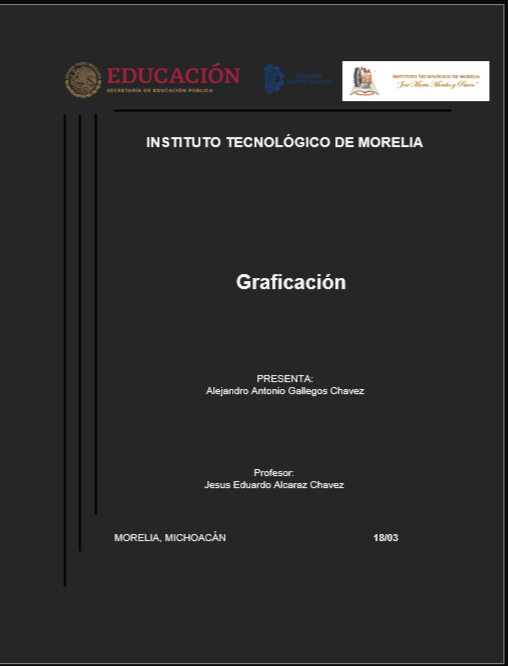
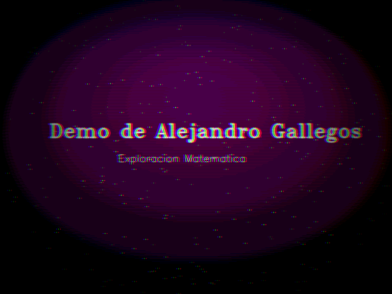
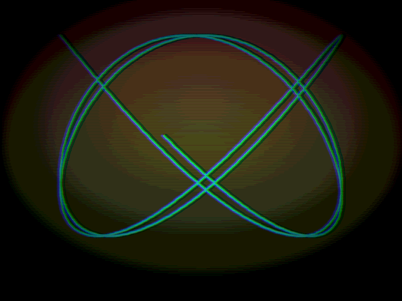
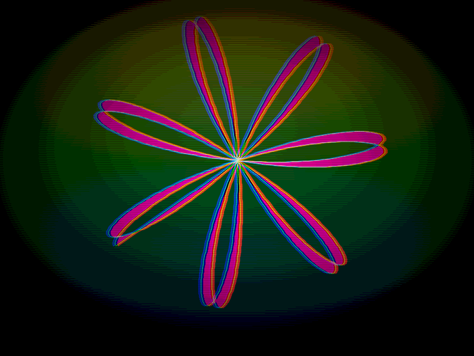
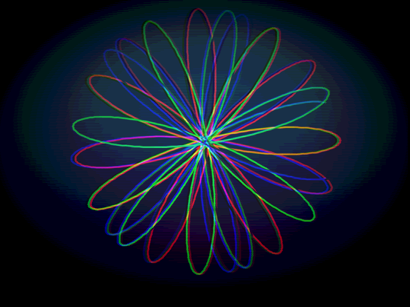
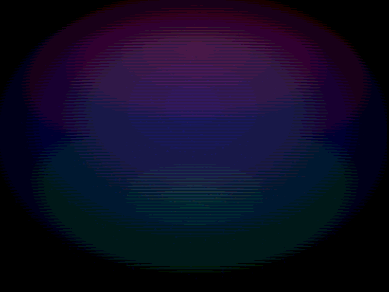
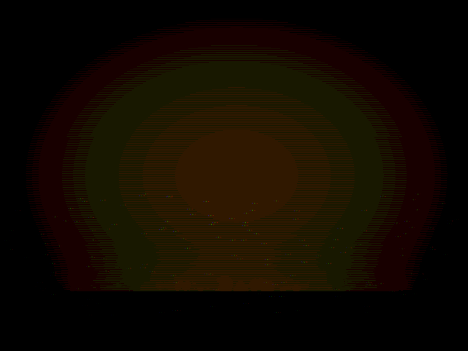
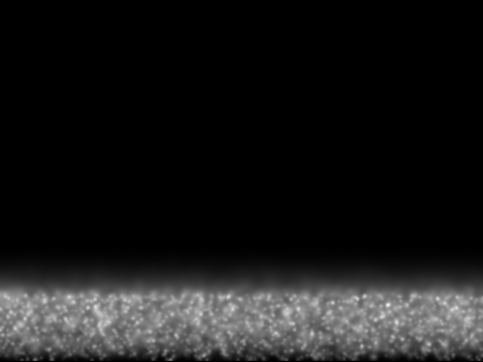

# Proyecto Final: Demo Procedural
**Nombre:** Alejandro Gallegos  
**Grupo:** [Tu Grupo Aquí]  
**Materia:** Graficación

---

## 1. Objetivo de la Práctica
Construir un demo procedural minimalista utilizando Python y OpenCV que demuestre el dominio de temas clave del curso: curvas paramétricas, transformaciones afines, composición por capas, gestión de una línea de tiempo (timeline) y efectos de post-procesamiento. Todo el contenido visual debe ser generado matemáticamente en tiempo real, sin el uso de recursos externos.

---

## 2. Capturas de las Escenas
Aquí se presentan las capturas de las 6 escenas generadas por el demo:

| Escena 1: Intro | Escena 2: Lissajous | Escena 3: Rosa Polar |
| :---: | :---: | :---: |
|  |  |  |
| **Escena 4: Spirograph** | **Escena 5: Partículas** | **Escena 6: Fuego** |
|  |  |  |

---

## 3. Máscaras Generadas
El demo utiliza máscaras para efectos de composición y post-procesamiento.

| Máscara de Viñeta (Vignette) | Mapa de Calor (Fire Heat Map) |
| :---: | :---: |
|  |  |
| *Utilizada para enfocar la visión central.* | *Utilizada para simular la convección del fuego.* |

---

## 4. Tabla Comparativa de Resultados

| Característica | Requisito Objetivo | Resultado Obtenido |
| :--- | :---: | :---: |
| **Resolución** | 800x600 | 800x600 (Cumplido) |
| **FPS Objetivo** | 30 FPS | ~30 FPS (Estable) |
| **Duración** | 30 - 60 segundos | 60 segundos |
| **Escenas** | Mínimo 6 | 6 Escenas distintas |
| **Curvas Paramétricas** | Mínimo 6 | 6 (Lissajous, Rosa, Espiral, etc.) |
| **Transformaciones** | Mínimo 2 | 4 (Rotación, Escala, Shear, Mirror) |
| **Post-procesamiento** | Mínimo 1 | 4 (Vignette, Scanlines, Posterize, Aberration) |

---

## 5. Respuestas a las Preguntas de Análisis

**1. ¿Cómo influye el uso del espacio de color HSV en la generación de transiciones visuales comparado con RGB?**  
*Respuesta:* El espacio HSV permite una manipulación mucho más intuitiva y fluida de la estética visual. Al variar únicamente el componente de "Hue" (tono), se pueden crear transiciones cromáticas naturales y vibrantes a través de todo el espectro sin perder la intensidad del color ni el brillo. En contraste, la interpolación directa en RGB suele producir colores "lavados" o grisáceos en los puntos intermedios, lo que dificultaría la generación de los gradientes dinámicos vistos en las escenas del demo.

**2. ¿Cuál es la importancia de las matrices afines en la animación de las curvas paramétricas?**  
*Respuesta:* Permiten encapsular operaciones de traslación, rotación y escalado en una sola estructura matemática. En este proyecto, se utilizan para posicionar las curvas (Lissajous, Rosa Polar) en el centro de la pantalla y ajustar su escala dinámicamente, asegurando que las proporciones se mantengan correctas independientemente de la complejidad de la función paramétrica

**3. ¿Cómo afecta la densidad de puntos (n) en las funciones `poly_param` a la calidad visual y al rendimiento?**  
*Respuesta:* La densidad de puntos determina la suavidad visual de la curva. Un valor de n elevado (como 1500-2000 usado en el demo) elimina el aspecto "segmentado" o poligonal, dando la ilusión de una curva continua y orgánica

---

## 6. Conclusión Final
El desarrollo de este demo procedural ha servido como una integración práctica de los pilares de la graficación por computadora. Mediante el uso exclusivo de lógica matemática y algoritmos. La implementación de técnicas como el sistema de partículas, mapas de calor para simulación de fuego y filtros de post-procesamiento demuestra la potencia de la programación creativa. Este proyecto resalta la importancia del diseño por computadora.
