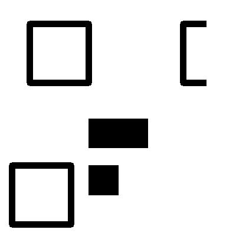
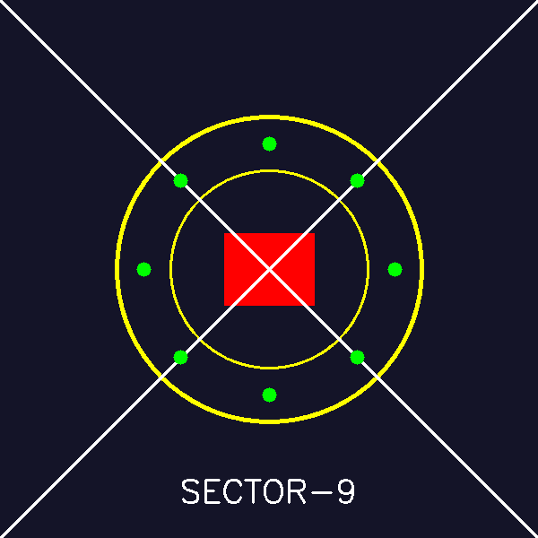
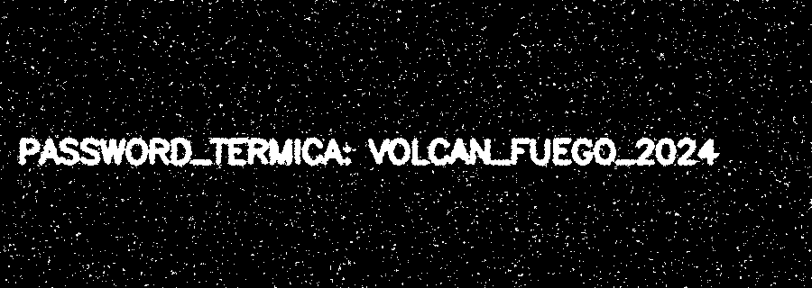
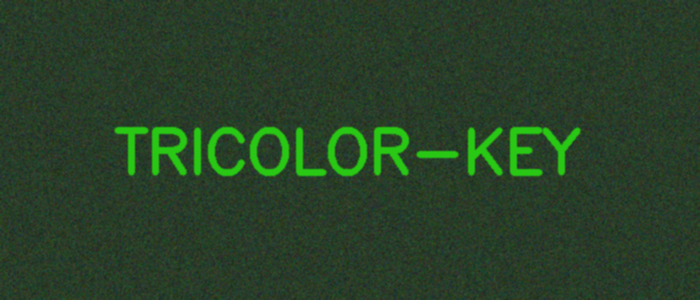
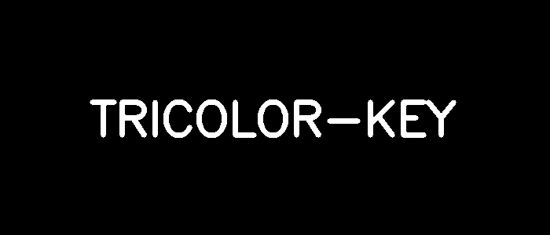

# Reporte de Misión: Graficación Táctica II
**Agente Especial:** Alejandro Gallegos 24120333

---
## Evidencias
### Misión 1
- Imagen recuperada x50: (inserta)

- Imagen recuperada x50 + 20: (inserta)

- Código:
[Misión 1](mision1.py)

### Misión 2
- QR reconstruido: (inserta)

- Código:
[Misión 2](mision2.py)

### Misión 3
- Sello forjado: (inserta)

- Código:
[Misión 3](mision3.py)

### Misión 4
- Máscara Cyan: (inserta)

- Código:
[Mision 4](mision4.py)

### Misión 5
- Evidencia tricolor: (inserta)

- Mensaje recuperado: (inserta)

- Código:
[text](mision5.py)

---
## Análisis del Analista (Reflexiones Finales)

1. **Operadores puntuales (M1):** ¿Qué diferencia visual hay entre recuperar con multiplicación (x50) y recuperar con suma (+50)? ¿Cuál preserva mejor el contraste del texto?
> [Respuesta] La multiplicación escala la diferencia entre los valores (aumenta la distancia entre el fondo oscuro y el texto claro), estirando el histograma y preservando/mejorando el contraste. Por otro lado, la suma (+50) simplemente desplaza todos los píxeles hacia arriba por igual

2. **Transformaciones geométricas (M2):** ¿Por qué es importante escoger el centro correcto al rotar una imagen con `getRotationMatrix2D`?
> [Respuesta] El centro de rotación actúa como el eje o "pivote". Si usamos las coordenadas equivocadas (por ejemplo, el origen 0,0 en lugar del centro geométrico de la pieza), la imagen no solo girará sobre sí misma, sino que orbitará alrededor de ese punto distante 

3. **Convolución (M4):** ¿Por qué un filtro promedio puede ayudar a reducir falsos positivos antes de segmentar por HSV, y qué desventaja tiene sobre los bordes del texto?
> [Respuesta] El ruido suele consistir en píxeles de alta frecuencia. Al usar un filtro promedio, el valor de cada píxel de ruido se diluye o "promedia" con sus vecinos más cercanos, apagando esos picos y evitando que cv2.inRange los detecte por error. La principal desventaja es que este mismo promedio afecta las transiciones válidas de la imagen, desenfocando (blurring) los bordes nítidos de las letras del texto y haciéndolas lucir ligeramente difuminadas.

4. **Canales (M5):** ¿Por qué separar canales puede revelar información que en la imagen a color “no se ve” a simple vista?
> [Respuesta] l ojo humano no percibe la luz en valores numéricos puros, sino que nuestro cerebro fusiona las ondas Rojas, Verdes y Azules para entregarnos una única percepción de color y luminosidad. Los canales BGR pueden ser manipulados matemáticamente para que una combinación específica engañe a nuestra vista fundiéndose visualmente con un fondo ruidoso. Al separar los canales (o restarlos), eliminamos esa "mezcla óptica" y podemos inspeccionar las anomalías de intensidad (los valores brutos de 0 a 255) en un plano unidimensional, haciendo evidente el contraste que estaba esteganografiado.