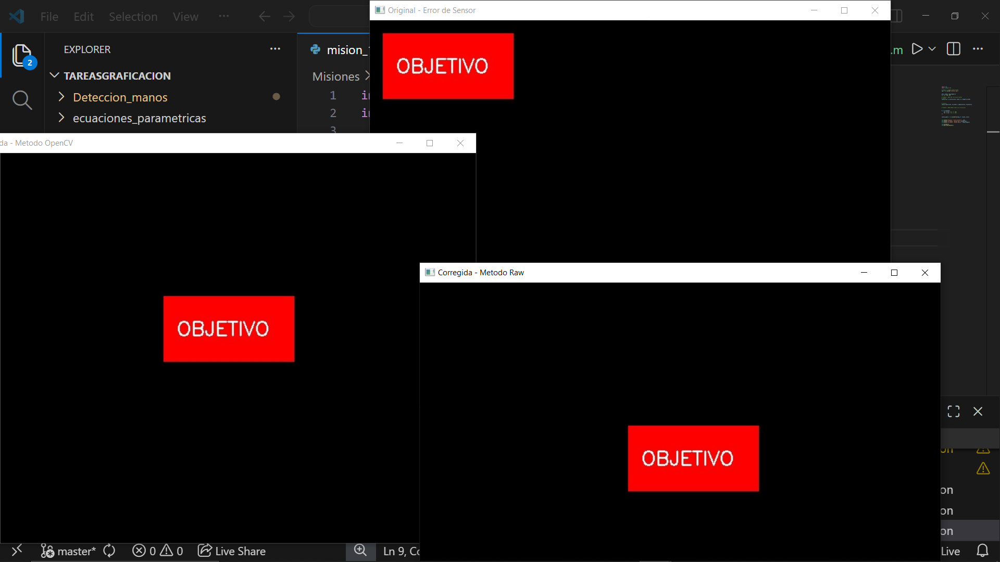
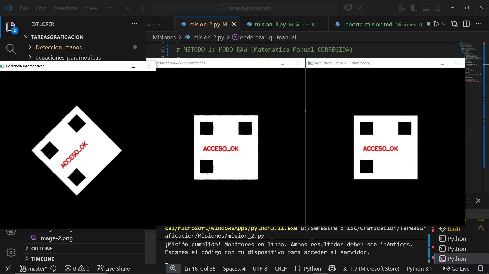
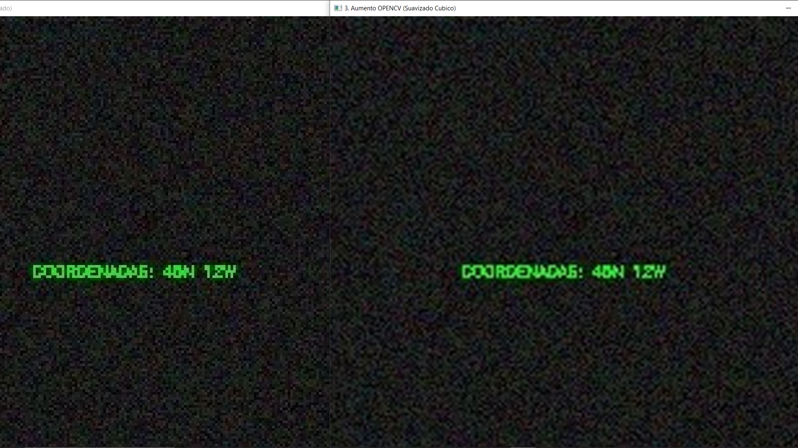

 

# Objetivo de la práctica.

## Comprender las aplicaciones de las transformaciones geométricas como lo son rotación y escalado aplicadas en imágenes digitales mediante dos formas matemática manual desde cero (Modo Raw) y el uso de la libreria OpenCV. El propósito es analizar y comparar la eficiencia, la calidad y el manejo de herramientas computacionales.

# Capturas de pantalla de las máscaras generadas.
# Actividad 1
[Codigo mision 1](mision_1.py)

# Actividad 2
[mision_2](mision_2.py)

# Actividad 3
[mision_3](mision_3.py)

# Tabla comparativa de resultados.
| Característica | Modo Raw (Matemática Manual) | Modo OpenCV (Librería Optimizada) |
| :--- | :--- | :--- |
| **Tiempo de Ejecución** | Muy lento (Tarda varios segundos en procesar). | Casi instantáneo (Fracción de segundo). |
| **Calidad de Rotación** | Básica. Depende de cómo se maneje el redondeo de decimales. | Alta. Bordes definidos y sin huecos de información. |
| **Calidad de Escalado (Zoom)** | Pixelada / Cuadriculada (Efecto de "escalera"). | Suave y continua (Efecto difuminado en los bordes). |
| **Complejidad del Código** | Alta. Requiere ciclos anidados y trigonometría pura. | Baja. Requiere solo una o dos líneas de código preconstruido. |
| **Uso de Recursos** | Alto. Procesa píxel por píxel secuencialmente en Python. | Bajo. Usa aceleración por hardware y código C/C++ interno. |

# Respuestas a las preguntas de análisis.

## ¿Notaste alguna diferencia de tiempo al procesar la imagen píxel por píxel con ciclos for (Modo Raw) en comparación con la función cv2.warpAffine de OpenCV? ¿Por qué crees que tu código manual tarda mucho más en ejecutarse?

la diferencia de tiempo es mucha. El Modo Raw tarda muchísimo más porque utiliza ciclos for anidado. Por el contrario, OpenCV está programado internamente en C y C++ y utiliza operaciones vectorizadas, por ende puede ejecutar al mismo tiempo en lugar de uno por uno.

## Al calcular la rotación píxel por píxel con tus fórmulas matemáticas (Modo Raw), ¿te quedaron 'puntos negros' o píxeles sin color esparcidos en la imagen resultante? ¿Cómo te imaginas que algoritmos profesionales como los de OpenCV logran rotar la imagen sin dejar esos huecos vacíos?

al rotar usando matemáticas directas suelen quedar puntos negros. Ocurre por el redondeo de decimales, las coordenadas rotadas casi nunca caen en un número entero exacto, dejando píxeles de destino sin información.

 En lugar de empujar píxeles hacia el lienzo vacío, OpenCV recorre el lienzo vacío y pregunta qué píxel original le corresponde. Si la coordenada cae entre cuatro píxeles originales, calcula un promedio de sus colores para rellenar ese punto a la perfección, asegurando que la imagen nueva tenga color.

## Al comparar visualmente el texto ampliado, ¿qué diferencia notas en los bordes de las letras entre tu resultado del Modo Raw y el de OpenCV usando la interpolación cv2.INTER_CUBIC?
En el Modo Raw, los bordes se ven formados por bloques cuadrados gigantes, un efecto visual muy tosco conocido como pixelado. En cambio, con la interpolación de OpenCV, los bordes lucen suaves, curvos y continuos.

## ¿De dónde crees que OpenCV saca los colores para rellenar y suavizar esos píxeles nuevos que en la imagen original no existían?
OpenCV inventa de manera inteligente esos nuevos colores a través de un proceso matemático llamado Interpolación. En el caso de INTER_CUBIC, el algoritmo analiza una cuadrícula de 16 píxeles vecinos (4x4) alrededor del punto vacío. Utiliza curvas matemáticas (polinomios) para calcular promedios ponderados y generar gradientes perfectos.

# Conclusión final.

Esta práctica demuestra que, aunque es fundamental comprender la matemática detrás de las transformaciones espaciales, implementar estos algoritmos de forma manual en lenguajes de alto nivel como Python no es viable para entornos de producción debido al inmenso costo computacional y a la aparición de defectos visuales. El uso de librerías de visión artificial como OpenCV es indispensable hoy, no solo porque reducen el tiempo de ejecución a fracciones de segundo mediante la vectorización, sino porque integran conceptos matemáticos avanzados, como el mapeo inverso y las interpolaciones complejas, garantizando resultados profesionales, eficientes y visualmente superiores con un esfuerzo de codificación mínimo.
