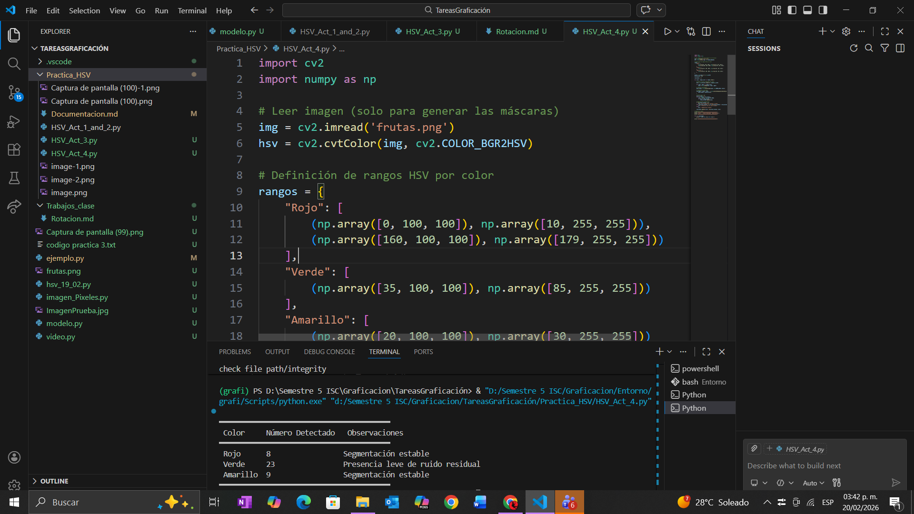

# Practica 1

## Actividad 1
 

``` python
import cv2
import numpy as np
img cv2.imread('frutas.png')
hsv cv2.cvtColor(img, cv2.COLOR_BGR2HSV)
np.array([15, 100, 100)) Hue, Saturación, Brillo lower green
np.array(135, 255, 255)) Hue, Saturación, Brillo 12 upper green
mask cv2.inRange(hsv, lower green, upper_green)
result cv2.bitwise_and(img, ing, mask-mask)
# Mostrar la imagen original y la imagen con el color detectado
cv2.imshow("Imagen Original", ing)
cv2.imshow("Color Detectado", result)
cv2.imshow("Mascara Blanco y Negro", mask)
cv2.waitKey(0)
cv2.destroyAllWindows()
```


 

•	¿Qué ocurre cuando el rango es muy estrecho?

Solo se muestra el color establecido en el rango, Se muestran menos objetos.

•	¿Qué ocurre cuando el rango es muy amplio?

Incluye mayor tonalidad de colores, llegando a incluir un poco mas distintos colores 


## Actividad 2: Limpieza de Ruido

1. Analizar la máscara sin aplicar operaciones morfológicas.
  2. Aplicar un método de limpieza (apertura o cierre).
  3. Comparar ambas máscaras.

```python 
import cv2
import numpy as np

# Leer la imagen
img = cv2.imread('frutas.png')

# Convertir la imagen al espacio de color HSV
hsv = cv2.cvtColor(img, cv2.COLOR_BGR2HSV)

kernel = np.ones((5,5), np.uint8)

# Definir el rango inferior y superior para detectar verde
lower_green = np.array([15, 100, 100])  # Hue, Saturación, Brillo mínimos
upper_green = np.array([35, 255, 255])  # Hue, Saturación, Brillo máximos

# Crear una máscara que solo incluya los píxeles dentro del rango
mask = cv2.inRange(hsv, lower_green, upper_green)
mask_apertura = cv2.morphologyEx(mask, cv2.MORPH_OPEN, kernel)

# Aplicar la máscara a la imagen original
result = cv2.bitwise_and(img, img, mask=mask)

# Mostrar la imagen original y la imagen con el color detectado
cv2.imshow("Imagen Original", img)
cv2.imshow("Color Detectado", result)
cv2.imshow("Mascara Blanco y Negro", mask)
cv2.imshow("Mascara Apertura", mask_apertura)
cv2.waitKey(0)
cv2.destroyAllWindows()
```


 • ¿Qué tipo de ruido aparece?

El ruido aparece como pixeles en en objetos sin interes 

 • ¿Por qué es necesario eliminarlo antes del conteo?

Es necesario porque asi eliminas islas falsas independientes


## Actividad 3: Conteo de Regiones

 1. Identificar cuántas regiones conectadas existen en la máscara.
  2. Filtrar regiones pequeñas (ruido).
  3. Reportar:
     • Número total de frutas detectadas.
     • Área aproximada de cada región válida.

  No se permite usar la imagen original para validar visualmente.  El
  análisis debe hacerse únicamente observando la máscara.

  ``` python
  import cv2
import numpy as np

img = cv2.imread('frutas.png')

hsv = cv2.cvtColor(img, cv2.COLOR_BGR2HSV)

lower_green = np.array([20, 100, 100])
upper_green = np.array([30, 255, 255])

mask = cv2.inRange(hsv, lower_green, upper_green)

kernel = np.ones((5, 5), np.uint8)
mask_limpia = cv2.morphologyEx(mask, cv2.MORPH_OPEN, kernel)


num_labels, labels, stats, centroids = cv2.connectedComponentsWithStats(
    mask_limpia, connectivity=8
)


area_minima = 500  # ajustar según tamaño de la imagen
areas_validas = []

for i in range(1, num_labels):  # ignorar el fondo (label 0)
    area = stats[i, cv2.CC_STAT_AREA]
    if area >= area_minima:
        areas_validas.append(area)


print("Número total de frutas detectadas:", len(areas_validas))

for idx, area in enumerate(areas_validas, start=1):
    print(f"Fruta {idx}: Área aproximada = {area} píxeles")


cv2.imshow("Mascara Original", mask)
cv2.imshow("Mascara Limpia", mask_limpia)
cv2.waitKey(0)
cv2.destroyAllWindows() 
```

  -1.png>)


## Actividad 4: Comparación entre Colores
══════════════════════════════════════

  Repetir el proceso para:

  • Frutas rojas
  • Frutas verdes
  • Frutas amarillas

  Construir una tabla comparativa:

  ``` pyhton 
  import cv2
import numpy as np

# Leer imagen (solo para generar las máscaras)
img = cv2.imread('frutas.png')
hsv = cv2.cvtColor(img, cv2.COLOR_BGR2HSV)

# Definición de rangos HSV por color
rangos = {
    "Rojo": [
        (np.array([0, 100, 100]), np.array([10, 255, 255])),
        (np.array([160, 100, 100]), np.array([179, 255, 255]))
    ],
    "Verde": [
        (np.array([35, 100, 100]), np.array([85, 255, 255]))
    ],
    "Amarillo": [
        (np.array([20, 100, 100]), np.array([30, 255, 255]))
    ]
}

kernel = np.ones((5, 5), np.uint8)
area_minima = 500

resultados = []

for color, rangos_color in rangos.items():

    # Generar máscara combinada por color
    mask = np.zeros(hsv.shape[:2], dtype=np.uint8)

    for lower, upper in rangos_color:
        mask |= cv2.inRange(hsv, lower, upper)

    # Limpieza morfológica
    mask_limpia = cv2.morphologyEx(mask, cv2.MORPH_OPEN, kernel)

    # Componentes conectados
    num_labels, labels, stats, _ = cv2.connectedComponentsWithStats(
        mask_limpia, connectivity=8
    )

    # Filtrar por área
    areas_validas = []
    for i in range(1, num_labels):
        area = stats[i, cv2.CC_STAT_AREA]
        if area >= area_minima:
            areas_validas.append(area)

    # Observaciones automáticas
    if len(areas_validas) == 0:
        obs = "No se detectaron regiones válidas"
    elif len(areas_validas) > 0 and min(areas_validas) < area_minima * 2:
        obs = "Presencia leve de ruido residual"
    else:
        obs = "Segmentación estable"

    resultados.append((color, len(areas_validas), obs))

# Reporte en tabla
print("━━━━━━━━━━━━━━━━━━━━━━━━━━━━━━━━━━━━━━━━")
print(" Color     Número Detectado   Observaciones")
print("━━━━━━━━━━━━━━━━━━━━━━━━━━━━━━━━━━━━━━━━")

for r in resultados:
    print(f" {r[0]:<9} {r[1]:<17} {r[2]}")

print("━━━━━━━━━━━━━━━━━━━━━━━━━━━━━━━━━━━━━━━━") 
```

  

  Preguntas:
  • ¿Qué color fue más fácil segmentar?
  El verde.
En términos prácticos, el verde vive cómodo en el espacio HSV. Su rango de matiz es amplio, estable y rara vez se confunde con sombras o reflejos.

  • ¿Cuál presentó más ruido?
  El amarillo tiende a contaminarse con:

Zonas muy iluminadas
Reflejos blancos
Partes claras del fondo

  • ¿Por qué?

  Verde:
bien definido + buena saturación → segmentación limpia.

  Rojo:
Necesita dos rangos HSV → mayor complejidad, pero ruido controlable.

  Amarillo:
Hue cercano a colores claros → sensible a iluminación → más ruido.

## Actividad 5 Analisis Critico

1. ¿Por qué HSV es más adecuado que RGB para esta tarea?
En RGB, los tres canales (rojo, verde, azul) mezclan información de color e intensidad, lo que dificulta separar el tono real de la iluminación.

En HSV (Hue, Saturation, Value), el canal H (Hue) representa directamente el color percibido (rojo, verde, amarillo, etc.), lo que facilita distinguir objetos por su tono.

Esto hace que HSV sea más robusto para segmentación por color, porque puedes trabajar principalmente con el tono y reducir la influencia de la iluminación.

2. ¿Cómo afecta la iluminación al canal V?
- El canal V (Value) representa el brillo o intensidad.

- Si la iluminación cambia (más luz o sombra), el valor de V se modifica, aunque el tono (H) siga siendo el mismo.

Por ejemplo, una fruta roja bajo luz intensa tendrá un V alto, y bajo sombra tendrá un V bajo, pero seguirá siendo roja en el canal H.

3. ¿Qué sucede si dos frutas tienen tonos similares?
- Si dos frutas comparten un rango de Hue parecido (ejemplo: una manzana roja y una fresa), la segmentación puede confundirlas.

- En esos casos, se necesita combinar H con S (Saturation) y V (Value) para diferenciarlas.

- Por ejemplo, la fresa puede tener un rojo más saturado y oscuro, mientras que la manzana puede tener un rojo más brillante.

4. ¿Qué limitaciones tiene la segmentación por color?
Sensibilidad a la iluminación: cambios de luz afectan saturación y valor.

- Colores similares: objetos distintos con tonos parecidos pueden confundirse.

- Reflejos y sombras: generan variaciones que pueden romper la segmentación.

- Cámaras diferentes: la calibración del sensor puede alterar los valores de color.

- No distingue textura ni forma: solo se basa en color, por lo que dos objetos distintos con el mismo tono se segmentan igual.