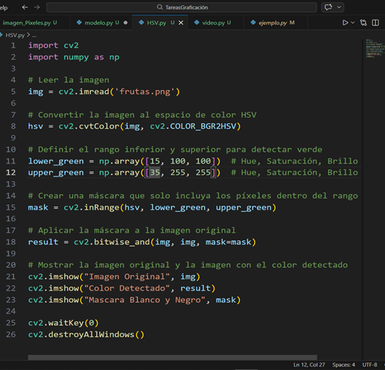
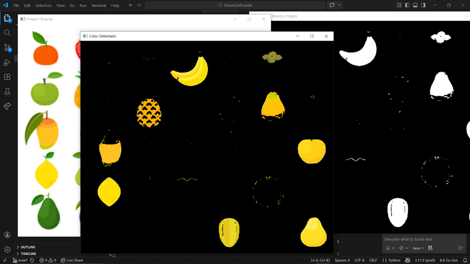
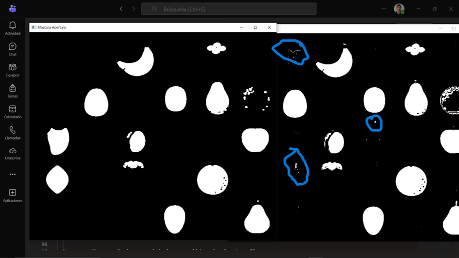

Practica 1

Actividad 1
 

 

•	¿Qué ocurre cuando el rango es muy estrecho?

Solo se muestra el color establecido en el rango

•	¿Qué ocurre cuando el rango es muy amplio?

Incluye mayor tonalidad de colores, llegando a incluir un poco distintos colores 

Actividad 2: Limpieza de Ruido

1. Analizar la máscara sin aplicar operaciones morfológicas.
  2. Aplicar un método de limpieza (apertura o cierre).
  3. Comparar ambas máscaras.

.png>)

 • ¿Qué tipo de ruido aparece?

El ruido aparece como pixeles en en objetos sin interes 

 • ¿Por qué es necesario eliminarlo antes del conteo?
 
Es necesario porque asi eliminas islas falsas independientes
